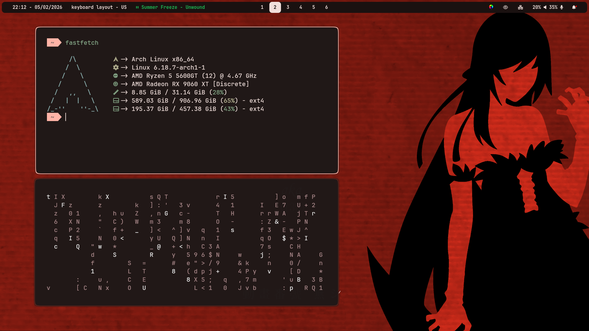
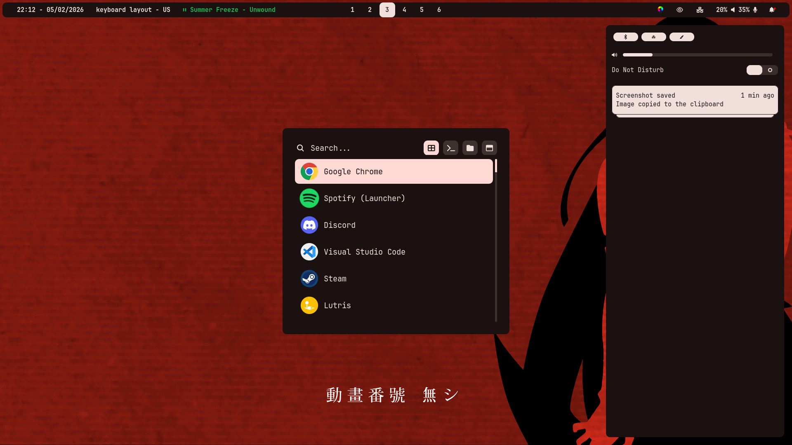
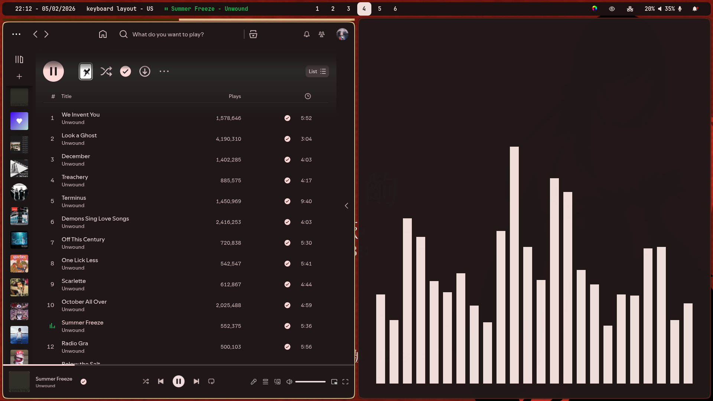

# my dotfiles

| component                | tool                                                           |
| ------------------------ | -------------------------------------------------------------- |
| **operating system**     | [arch linux](https://archlinux.org/)                           |
| **wayland compositor**   | [hyprland](https://hypr.land/)                                 |
| **status bar**           | [waybar](https://github.com/Alexays/Waybar)                    |
| **application launcher** | [rofi](https://github.com/in0ni/rofi-wayland)                  |
| **notification daemon**  | [swaync](https://github.com/ErikReider/SwayNotificationCenter) |
| **terminal**             | [kitty](https://github.com/kovidgoyal/kitty)                   |
| **shell**                | [zsh](https://github.com/zsh-users/zsh.git)                    |
| **system info tool**     | [fastfetch](https://github.com/fastfetch-cli/fastfetch)        |
| **color generation**     | [matugen](https://github.com/InioX/matugen)                    |

---

